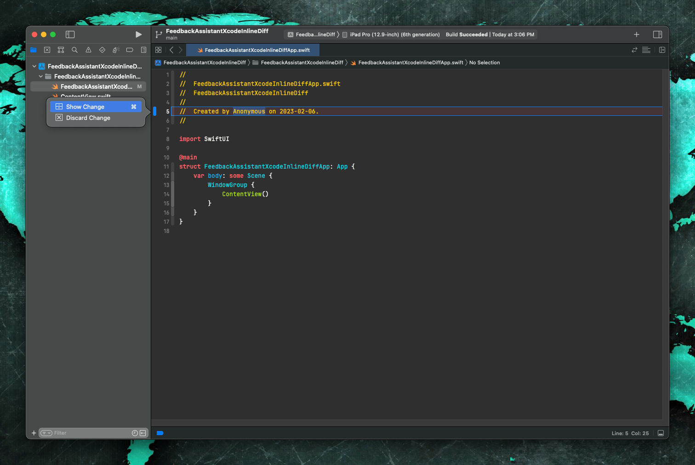

# Overview

There is a bug in Xcode that prevents inline diff to properly show up.

## Step 1

Create an empty project and commit to version control

## Step 2

Modify a file that's been committed

## Step 3

Click the gutter diff indicator and select "show changes"

## Step 4

The diff is not properly displayed, the previous code gets cut off.

This appears to be the case in all themes that ships with Xcode and custom themes as well

